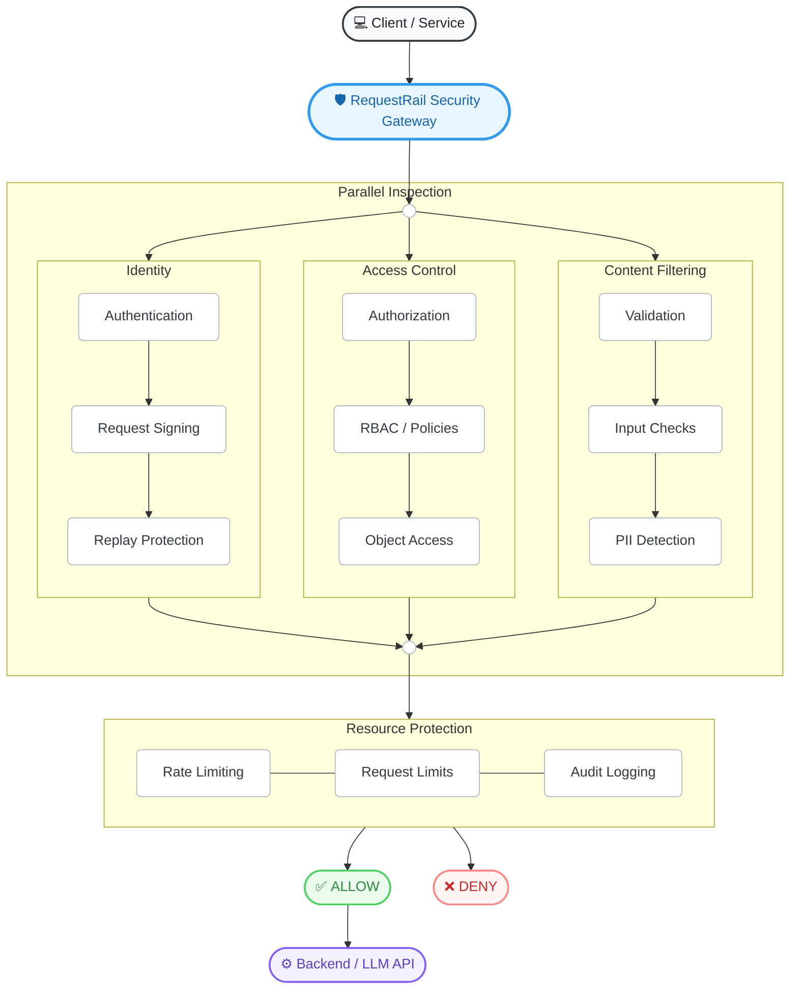

# 🛡️RequestRail — A Rust Security and Policy Gateway for Distributed Services

**RequestRail** is a high-performance, modular Rust Security & Policy Gateway designed for distributed services. It provides a unified application-security platform to protect your APIs and AI-enabled services using a robust, highly extensible pipeline of security guards.


---

## 🔒 Hardened for Reliability-Sensitive Code

RequestRail is built on the philosophy that **every guarantee is backed by a robust architecture**.

<table>
  <tr>
    <td width="50%">
      <h3>✅ Panic Isolation</h3>
      <p>A <code>catch_unwind</code> boundary wraps every guard evaluation. If a custom guard panics, it translates safely into a <code>GuardError::Panicked</code> without crashing the gateway.</p>
    </td>
    <td width="50%">
      <h3>✅ Fail-Closed Default</h3>
      <p>A guard that errors out automatically blocks the request unless explicitly opted out using the <code>FailPolicy</code> configuration. Security always fails closed.</p>
    </td>
  </tr>
  <tr>
    <td width="50%">
      <h3>✅ Strict Deadlines</h3>
      <p>Guards are constrained by strict microsecond timeouts. Violations result in a <code>DeadlineViolated</code> error, preventing slow-loris and resource exhaustion attacks.</p>
    </td>
    <td width="50%">
      <h3>✅ Always a Trace</h3>
      <p>Every evaluation produces a bounded audit trace, whether the request is allowed, denied, or panics, ensuring total observability.</p>
    </td>
  </tr>
</table>

---

## 🏗️ Architecture

RequestRail is built around a blazingly fast `Pipeline` that evaluates incoming requests against a series of `Guard` modules. If any guard blocks the request, the pipeline short-circuits. If all guards allow it, the request proceeds to your backend.



## 📦 Workspace Structure

The project is divided into several focused crates:

- **`requestrail-core`**: The foundational pipeline engine, `Context`, `Verdict`, observability traits, and metrics.
- **`requestrail-guards`**: 15 pre-built security modules ready for production use (including Redis-backed distributed guards).
- **`requestrail-config`**: YAML-based dynamic configuration loader to build pipelines without recompiling.
- **`requestrail-http`**: Axum/Tower middleware adapter to drop RequestRail directly into your web servers.
- **`requestrail-llm`**: Specialized pre-configured pipelines tailored for protecting LLM inputs (Prompt Injection) and outputs (Data Leakage).

## 🏢 Enterprise / Production Features

*   **Distributed State (Redis)**: Drop in `RedisRateLimitGuard` and `RedisReplayProtectionGuard` to synchronize rate limits and nonces across a fleet of globally distributed API gateways.
*   **Dynamic Configuration**: Load complex security policies at runtime from a YAML file.
    ```yaml
    name: "Production Gateway"
    guards:
      - type: "AuditLogging"
        preview_body: true
      - type: "RedisRateLimit"
        redis_url: "redis://127.0.0.1/"
        capacity: 1000
        requests_per_second: 50.0
      - type: "PiiDetection"
        mode: "redact"
    ```

## 🛡️ Built-in Security Guards

RequestRail comes with 15 pre-built security guards categorized into three tiers:

### Tier 1: Identity, Rate Limiting & Integrity
*   **AuthenticationGuard**: HMAC-SHA256 service/user authentication.
*   **RbacGuard**: Role-based access control on paths.
*   **PolicyEngineGuard**: Declarative rule-based decision engine.
*   **PiiDetectionGuard**: Detects/redacts PII (Emails, SSNs, Phone, IPs).
*   **SecretDetectionGuard**: Detects leaked API keys, tokens, and passwords.
*   **RateLimitGuard**: Token-bucket per-client rate limiting.
*   **RequestSigningGuard**: HMAC request integrity verification.
*   **ReplayProtectionGuard**: Nonce-based replay attack prevention.
*   **AuditLoggingGuard**: Creates structured JSON audit trails for SIEMs.

### Tier 2: Authorization & Validation
*   **ObjectAuthGuard**: BOLA (Broken Object Level Authorization) protection.
*   **FunctionAuthGuard**: BFLA (Broken Function Level Authorization) protection.
*   **InputValidationGuard**: Validates JSON structure, depth, and null bytes.
*   **RequestSizeLimitGuard**: Enforces maximum payload sizes.
*   **RegexFilterGuard**: Configurable regex deny-lists.

### Tier 3: AI & LLM Protection
*   **PromptInjectionGuard**: Heuristic-based detection of DAN and jailbreak attacks.
*   **LlmOutputGuard**: Output scanning for system prompt and internal config leakage.

## Quickstart (clone to a running example)

Needs [Rust 1.70+](https://www.rust-lang.org/tools/install). From a shell:

```sh
git clone https://github.com/alphaBytes10/RequestRail.git
cd RequestRail
cargo run --example axum_middleware
```

You should see the web server start up, protected by RequestRail. You can then test it:

```sh
# Allowed request
curl -sS -X POST -d "hello from requestrail" http://127.0.0.1:3000/api/echo

# Blocked request (Rate Limiter or PII Guard kicking in)
curl -sS -X POST -d "My email is test@example.com" http://127.0.0.1:3000/api/echo
```

Already on a synchronous server? `cargo run --example sync_http_server`. Wrapping an LLM call? `cargo run --example llm_chat_guard`. Want to see structured spans and metrics? `cargo run --example observability`.

## Use it in your crate

```toml
[dependencies]
requestrail-core = "0.1.0"
requestrail-guards = "0.1.0"
```

Optional adapters: `requestrail-http` (axum/tower middleware), `requestrail-llm` (blocking model call wrapper), and `requestrail-config` (YAML pipeline builder). 

```rust
use std::sync::Arc;
use requestrail_core::{Context, Pipeline};
use requestrail_guards::{RateLimitGuard, PiiDetectionGuard};
use requestrail_guards::pii::PiiMode;

fn main() {
    let pii_guard = PiiDetectionGuard::new(PiiMode::Block).expect("built-in pattern");
    let rate_limiter = RateLimitGuard::new(100, 10.0);
    
    let pipeline = Pipeline::new()
        .with(rate_limiter)
        .with(pii_guard);
 
    let ctx = Context::new("My email is test@example.com");
    let (verdict, audit_log) = pipeline.evaluate(ctx).unwrap();

    assert!(verdict.is_block());
}
```

## 🤝 Contributing

Contributions are welcome! Please feel free to submit a Pull Request. See [CONTRIBUTING.md](CONTRIBUTING.md) for details. This project is governed by our [Code of Conduct](CODE_OF_CONDUCT.md).

## 📄 License

This project is licensed under the [MIT License](LICENSE).
